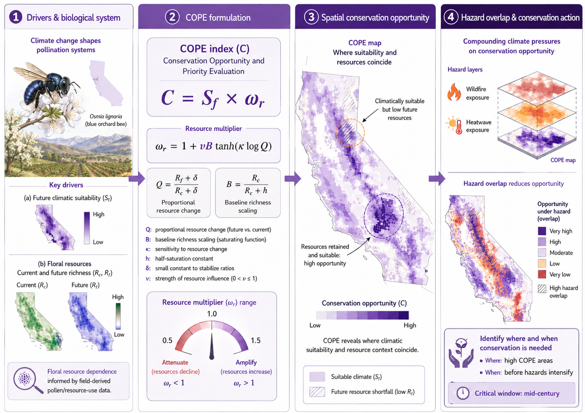

# COPE index and climate-driven vulnerability of pollination systems

This repository contains the code and workflow used to model climate-driven changes in pollinator suitability, floral resource availability, conservation opportunity, and climate-hazard exposure for a California pollination system. The project focuses on the blue orchard bee, *Osmia lignaria*, and its native floral resources as a model system to evaluate when and where conservation action may be most effective under climate change.

The central product of the workflow is the **Conservation Opportunity and Priority Evaluation (COPE) index**, a spatially explicit index that combines future pollinator climatic suitability with projected changes in floral resource richness. COPE is then evaluated under projected wildfire and heatwave exposure to identify areas where conservation opportunity may remain viable or become constrained by compounding climate pressures.

## Repository structure

```text
.
├── figures/
├── inputs/
├── Osmia.lignaria/
├── outputs/
├── Python/
├── R/
│   ├── old/
│   ├── 0A_get_climate_data.R
│   ├── 0B_get_records_data.R
│   ├── 1A_ensemble_modeling_osmia.R
│   ├── 1B_ensemble_modeling_plants.R
│   ├── 2A_sdm_calc_results.R
│   ├── 2B_sdm_calc_winners_losers.R
│   ├── 3A_cope_analysis.R
│   ├── 3B_cope_hazards.R
│   ├── udf_calculate_biovars.R
│   ├── udf_envSamp.R
│   ├── udf_project_ca_ensemble.R
│   └── x_sup_mat_var_import.R
├── COPE_conceptual_figure.png
├── COPE_index_and_hazards.Rproj
├── download_parallel.sh
├── LICENSE
└── README.md
```

## Workflow overview

The analysis is organized as a sequential workflow. Scripts are numbered according to the main order of execution.

### 1. Data preparation

**`R/0A_get_climate_data.R`**  
Downloads and prepares climate data used for ecological niche modeling.

**`R/0B_get_records_data.R`**  
Cleans and prepares occurrence records for *Osmia lignaria* and its floral resource species.

### 2. Ecological niche modeling

**`R/1A_ensemble_modeling_osmia.R`**  
Fits ensemble ecological niche models for *Osmia lignaria* and projects climatic suitability across baseline and future climate scenarios.

**`R/1B_ensemble_modeling_plants.R`**  
Fits ensemble ecological niche models for native floral resource species used by *Osmia lignaria*.

### 3. Model summaries and projected area change

**`R/2A_sdm_calc_results.R`**  
Calculates model evaluation summaries, binary suitable areas, and projected changes in climatic suitability.

**`R/2B_sdm_calc_winners_losers.R`**  
Summarizes projected gains and losses in suitable area across species, time periods, and emissions scenarios.

### 4. COPE index

**`R/3A_cope_analysis.R`**  
Calculates the COPE index by combining future pollinator suitability with projected changes in floral resource richness.

COPE is defined as:

```math
C = S_f \cdot \omega_r
```

where `S_f` is future climatic suitability and `ω_r` is a resource-response multiplier based on projected changes in floral resource richness.

### 5. Hazard overlay

**`R/3B_cope_hazards.R`**  
Overlays COPE with wildfire and heatwave exposure to identify conservation opportunities that may be constrained by climate-related hazards.

### 6. Utility scripts

**`R/udf_calculate_biovars.R`**  
Functions to calculate bioclimatic variables.

**`R/udf_envSamp.R`**  
Functions for environmental sampling and pseudo-absence generation.

**`R/udf_project_ca_ensemble.R`**  
Functions for projecting ensemble models across California.

**`R/x_sup_mat_var_import.R`**  
Summarizes variable importance for supplementary material.

## Main outputs

The workflow generates outputs in the `outputs/` directory, including:

- ensemble suitability rasters for *Osmia lignaria*
- ensemble suitability rasters for floral resource species
- binary suitable/unsuitable maps
- projected suitable area summaries
- floral resource richness maps
- COPE index rasters
- hazard-overlap maps
- summary tables for the manuscript and supplementary material

Figures are exported to the `figures/` directory.

## Conceptual framework

The COPE framework integrates three components:

1. **Pollinator climatic suitability**  
   Future suitability for *Osmia lignaria* under climate change.

2. **Floral resource change**  
   Projected changes in native floral resource richness between current and future periods.

3. **Climate-hazard exposure**  
   Wildfire and heatwave exposure used to evaluate whether high-opportunity areas remain viable conservation targets.

Together, these components identify not only where pollination systems may persist, but also where conservation opportunities may be reduced by resource loss or climate hazards.

## Running the workflow

Open the R project:

```text
COPE_index_and_hazards.Rproj
```

Then run the numbered scripts in order:

```r
source("R/0A_get_climate_data.R")
source("R/0B_get_records_data.R")
source("R/1A_ensemble_modeling_osmia.R")
source("R/1B_ensemble_modeling_plants.R")
source("R/2A_sdm_calc_results.R")
source("R/2B_sdm_calc_winners_losers.R")
source("R/3A_cope_analysis.R")
source("R/3B_cope_hazards.R")
```

Large downloads can be started from the shell using:

```bash
bash download_parallel.sh
```

## Software

The workflow was developed primarily in R. Key R packages include:

- `tidyverse`
- `terra`
- `sf`
- `biomod2`
- `ggplot2`
- `patchwork`
- `furrr`
- `rnaturalearth`

Additional Python scripts, if used, are stored in the `Python/` directory.

## Data availability

Input data are organized in the `inputs/` directory. Large raster files and intermediate model outputs may not be tracked directly in this repository. Users should download or regenerate these files using the data preparation scripts.

## Citation

If you use this workflow or adapt the COPE index, please cite the associated manuscript:

> González Chávez et al. *Climate-driven shifts in bee and floral vulnerability alter when and where conservation is needed.*

## License

This repository is released under the license specified in the `LICENSE` file.

DISSCLAIMER: THIS README HAVE BEEN GENERATED USING AI AND CORRECTED FOR ERRORS.
